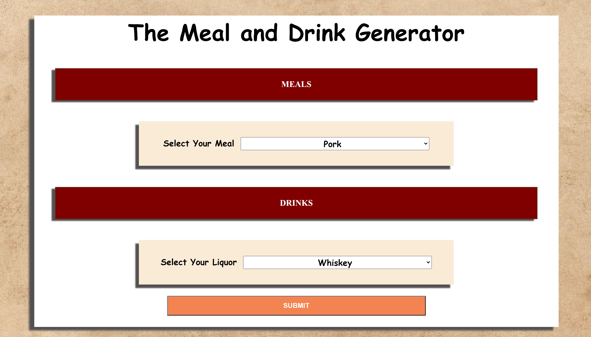
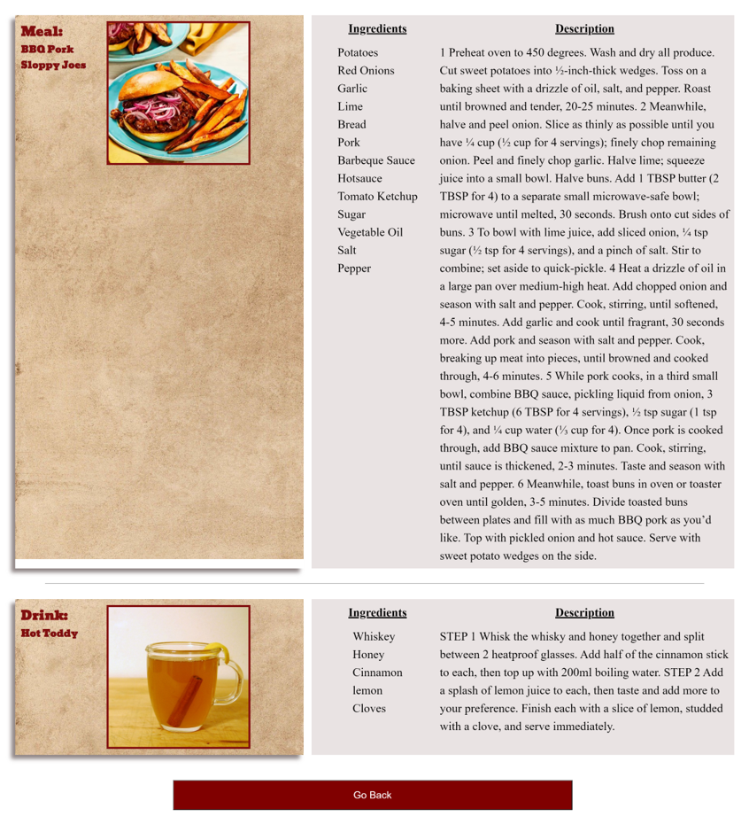
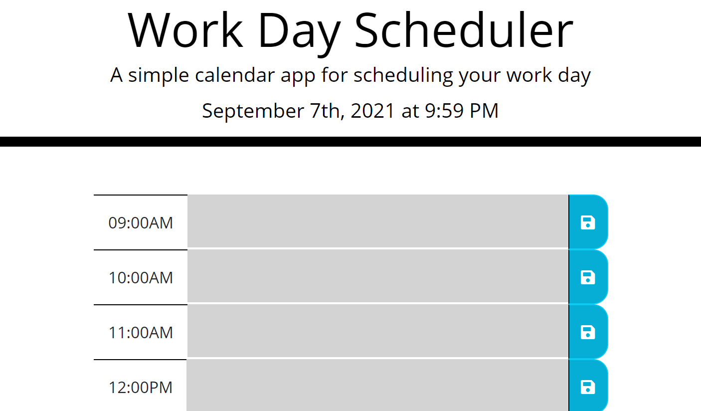
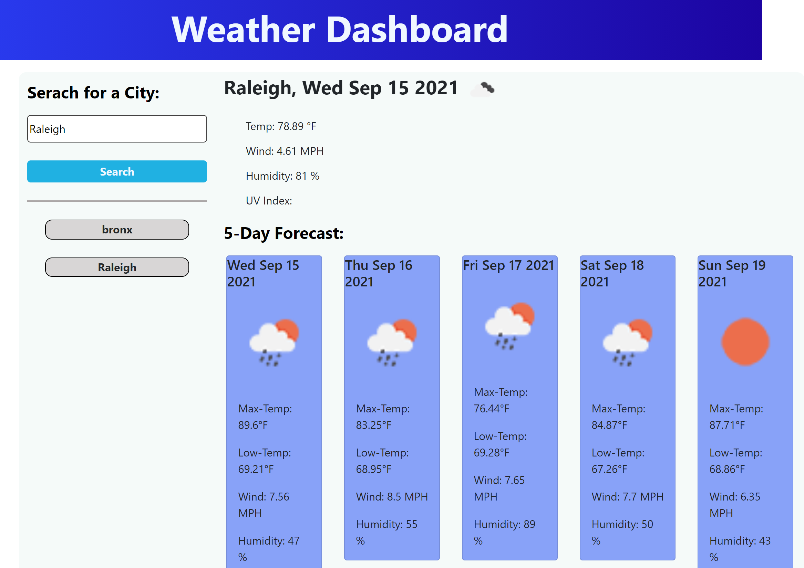

# Terrence Meikle's Portfolio

## Overview

#### My intent is to showcase my competencies as a full stack web developer to potential employers, as well as fellow developers looking to collaborate on future projects.

#### Below you will find links to my Resume as well as links and images to some of my recent works.

## Portfolio

## Recent works

### Third Part API

[Meal and Drink Generator](https://terrence-me.github.io/project1/)

[Work Day Scheduler](https://terrence-me.github.io/work-day-scheduler/)

[Weather Dashboard](https://terrence-me.github.io/weather-dashboard/)
